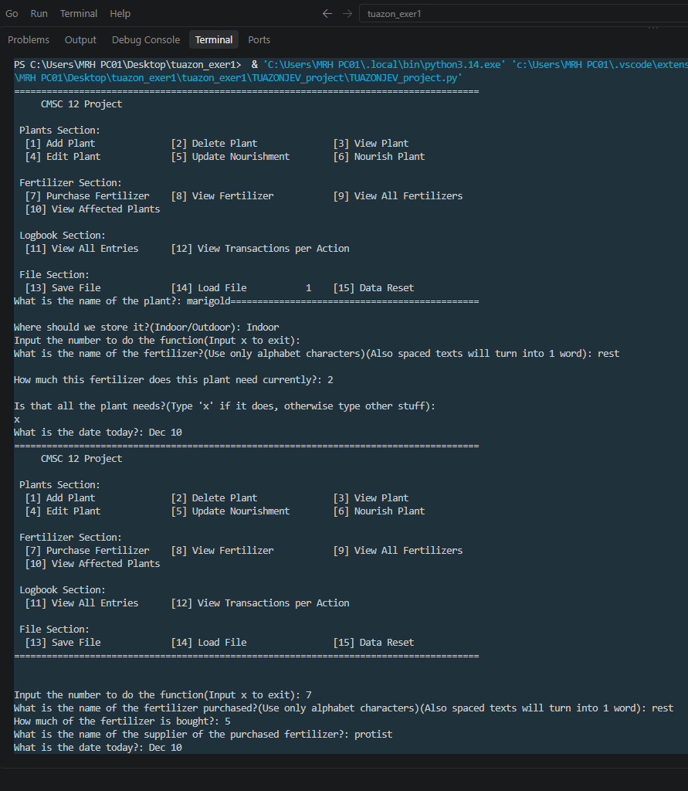
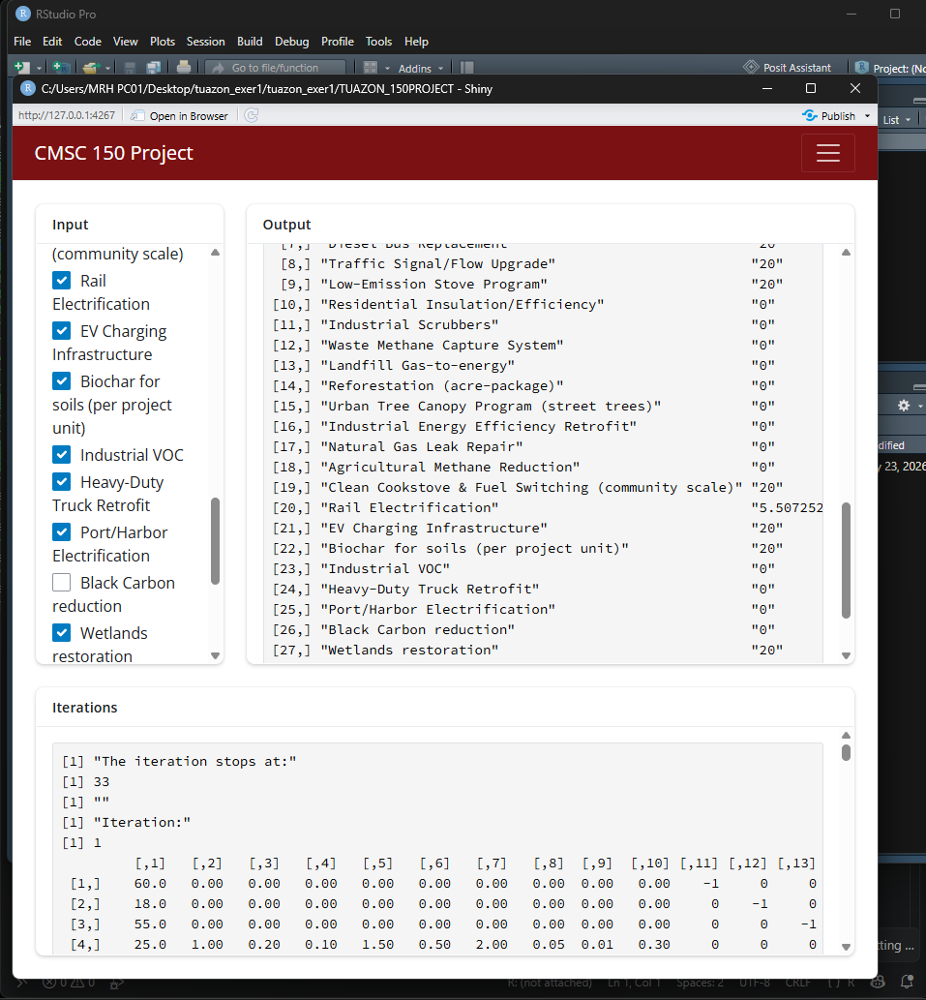
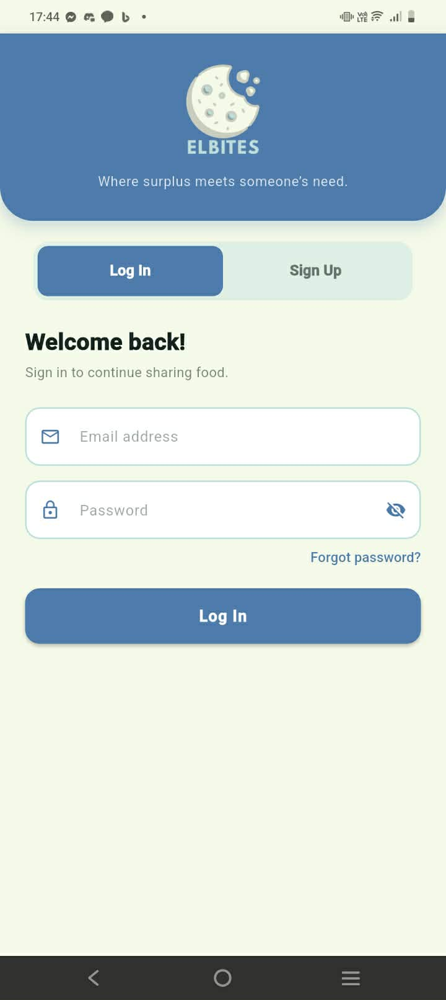
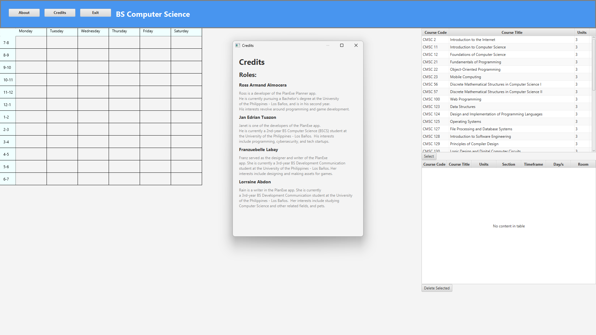
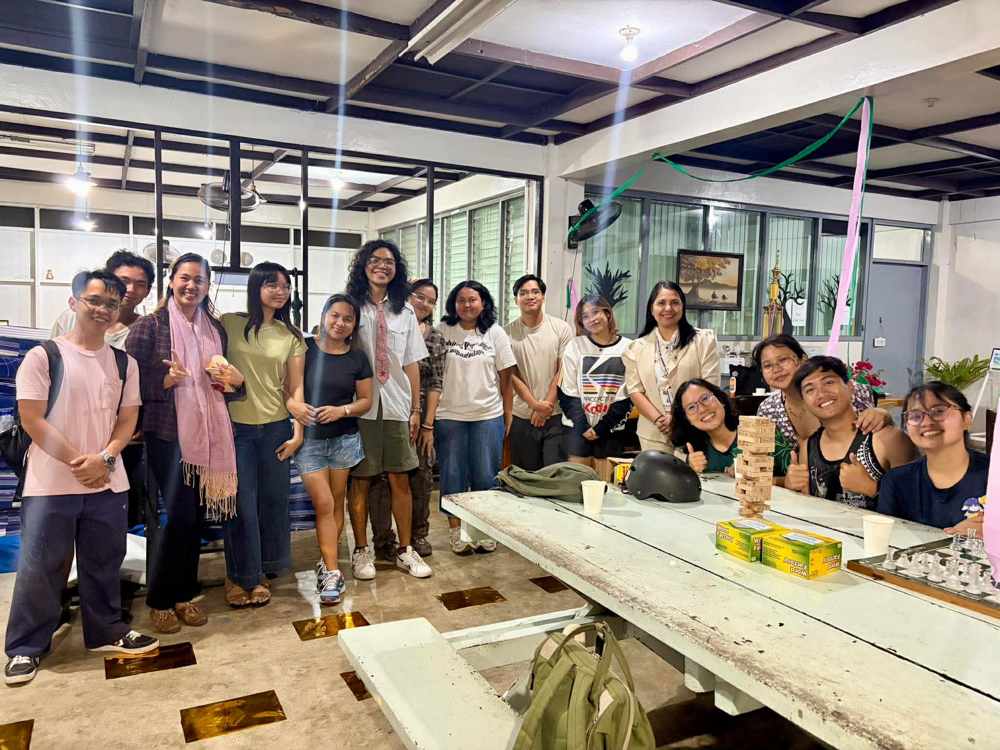

<!-- Jan Edrian Tuazon -->

<!--
Outline:
I. Short Introduction: [Photo, Column0]
    a. Photo
    b. Column0
        1. Autobiography
        2. Summary of Skills

II. Projects: [Skill, Project Column]
    a. Skill
    b. Project Column [Photographic Evidence, Short Description]
-->

<!DOCTYPE html>
<html>
    <head>
        <title>Jan Edrian V. Tuazon</title>
        <link rel="stylesheet" type="text/css" href="tuazon100_exer1.css">
    </head>
    <body>
         
        <platform>
            <row-flex-container><!-- Photos, Autobiography, and Summary of Skills -->
                <flex-item style="flex: 2"><!-- Photo -->
                    
                </flex-item>
                <column-flex-container style="flex: 9">
                    <flex-item><!-- Autobiography -->
                        <insideplatform>
                            <legend>
                                Autobiography
                            </legend>
                            

                                I am Jan Edrian V. Tuazon and I want to make the most of my life. I am currently in my 3rd year in my degree program, Bachelor of Science Computer Science. I was valedictorian at my preschool and elementary school during my stay at St. Michael Academy of Valenzuela, Inc. Bagbaguin Branch. However in my years at high school, I have made myself content with the bare minimum and have barely made achievements. I was only expecting to finish my college and live with only stability in mind. But, there was a drive inside that was fully discovered when I came here; I appreciate the elegance of the world in its totality. I have my talents in mathematics and with it I saw some of the connected patterns of this world. Thus being here, I’ll try to make the best use of my life.
                            

                        </insideplatform>
                        
                    </flex-item>
                    <flex-item><!-- Summary of Skills -->
                        <insideplatform>
                            <legend>
                                Summary of Skills
                            </legend>
                            <ul>
                                <li>Python Programming amounting 6 months worth of experience</li>
                                <li>C Programming amounting 1 year worth of experience</li>
                                <li>Java Programming amounting 6 months worth of experience</li>
                                <li>RStudio Programming amounting 6 months worth of experience</li>
                                <li>Assembly Programming amounting 6 months worth of experience</li>
                                <li>Flutter Programming amounting 6 months worth of experience</li>
                                <li>Management amounting 1.5 years worth of experience</li>
                            </ul>
                        </insideplatform>
                        
                    </flex-item>
                </column-flex-container>
            </row-flex-container>
        </platform>
        

         

        <platform>
            <column-flex-container><!-- List of my Projects -->
                <row-flex-container><!-- Goes by 2s --><!-- 1st -->
                    <row-flex-container style="flex: 1">
                        <flex-item style="flex: 1"><!-- Skill relating to my projects -->
                            <insideplatform>
                                

                                    Python Programming
                                

                            </insideplatform>
                            
                        </flex-item>
                        
                        <column-flex-container style="flex: 9">

                            <row-flex-container>
                                <flex-item style="flex: 5"><!-- Photographic Evidence -->
                                    
                                    

                                </flex-item>

                                <flex-item style="flex: 3"><!-- Description -->
                                    <insideplatform>
                                         
                                        <b>
                                            Gardening Inventory System
                                        </b>
                                        <ul>
                                            <li>It logs the plants and fertilizers that you have. It also logs the amount of fertilizer and can also subtract that amount when they are used for the plants. It also saves the data encoded into it and encrypts it.</li>
                                            <li>It was made as a course requirement for CMSC 12 in my first year in college and it is done individually.</li>    
                                        </ul>
                                        
                                    </insideplatform>
                                </flex-item>
                            </row-flex-container>

                        </column-flex-container>
                    </row-flex-container>

                    <row-flex-container style="flex: 1">
                        <flex-item style="flex: 1"><!-- Skill relating to my projects -->
                            <insideplatform>
                                

                                    R Programming
                                

                            </insideplatform>
                            
                        </flex-item>
                        
                        <column-flex-container style="flex: 9">

                            <row-flex-container>
                                <flex-item style="flex: 6"><!-- Photographic Evidence -->
                                    
                                    

                                </flex-item>

                                <flex-item style="flex: 3"><!-- Description -->
                                    <insideplatform>
                                         
                                        <b>
                                            Cost Minimization Calculator for the City Pollution Reduction Plan
                                        </b>
                                        <ul>
                                            <li>It consists of all the available tentative projects the government of Greenvale can implement to eliminate pollution in their city.</li>
                                            <li>It works by picking the projects that will be implemented and the calculator will answer if it is feasible and if it is, it will show the minimal amount of said projects that must be done.</li>
                                            <li>It was made as a course requirement for CMSC 150 in my second year in college and it is done individually.</li>    
                                        </ul>
                                        
                                    </insideplatform>
                                </flex-item>
                            </row-flex-container>

                        </column-flex-container>
                    </row-flex-container>
                </row-flex-container>
                
                <row-flex-container><!-- Goes by 2s --><!-- 2nd -->
                    <row-flex-container style="flex: 1">
                        <flex-item style="flex: 1"><!-- Skill relating to my projects -->
                            <insideplatform>
                                

                                    Flutter Programming
                                

                            </insideplatform>
                            
                        </flex-item>
                        
                        <column-flex-container style="flex: 9">

                            <row-flex-container>
                                <flex-item style="flex: 3"><!-- Photographic Evidence -->
                                    
                                    

                                </flex-item>

                                <flex-item style="flex: 6"><!-- Description -->
                                    <insideplatform>
                                         
                                        <b>
                                            Elbi Food Sharing App
                                        </b>
                                        <ul>
                                            <li>It’s a platform where users can share food across other users, much like a community pantry.</li>
                                            <li>It utilizes Firebase as the persistence and authentication aspect for the app.</li>    
                                            <li>It was made as a course requirement for CMSC 150 in my second year in college and it is done by group. I made the QR code security for the app to ensure that a transaction has happened.</li>
                                        </ul>
                                        
                                    </insideplatform>
                                </flex-item>
                            </row-flex-container>

                        </column-flex-container>
                    </row-flex-container>

                    <row-flex-container style="flex: 1">
                        <flex-item style="flex: 1"><!-- Skill relating to my projects -->
                            <insideplatform>
                                

                                    Java Programming
                                

                            </insideplatform>
                            
                        </flex-item>
                        
                        <column-flex-container style="flex: 9">

                            <row-flex-container>
                                <flex-item style="flex: 9"><!-- Photographic Evidence -->
                                    
                                    

                                </flex-item>

                                <flex-item style="flex: 4"><!-- Description -->
                                    <insideplatform>
                                         
                                        <b>
                                            Course Registration Planner
                                        </b>
                                        <ul>
                                            <li>It is a JavaFX application where users can plan their class schedule similar to AMIS. Like AMIS, users can pick which courses they want to take and what section they would like to be in. It also has a calendar on the left so that users can see what courses they took overlap so they can adjust accordingly.</li>
                                            <li>It was made as a course requirement for CMSC 22 in my second year in college and it is done by group. I made the calendar.</li>    
                                        </ul>
                                        
                                    </insideplatform>
                                </flex-item>
                            </row-flex-container>

                        </column-flex-container>
                    </row-flex-container>
                </row-flex-container>

                <row-flex-container style="flex: 1">
                    <flex-item style="flex: 1"><!-- Skill relating to my projects -->
                        <insideplatform>
                            

                                Management
                            

                        </insideplatform>
                        
                    </flex-item>
                    
                    <column-flex-container style="flex: 9">

                        <row-flex-container>
                            <flex-item style="flex: 3"><!-- Photographic Evidence -->
                                
                                

                            </flex-item>

                            <flex-item style="flex: 6"><!-- Description -->
                                <insideplatform>
                                     
                                    <b>
                                        MRH Open House
                                    </b>
                                    <ul>
                                        <li>Men’s Residence Hall (MRH) is a university dormitory situated by Freedom Park. It has a student-led dormitory association, Men’s Residence Hall Association (MRHA), which represents and supports the residents in it. I have been the President of the MRHA ever since the 2nd Semester, ‘25-’26.</li>
                                        <li>Alliance of Dormitory Associations (ADA) have mandated an event wherein we should participate in preparing for the Open House. The Open House allows non-residents to enter the premises of the dormitory as an invitation to outsiders.</li>
                                        <li>Under my management, we have prepared food and entertained about 250 people with our stored board games in our TV Lounge. We only allowed them at the TV Lounge however, despite being Open House, as precaution for the security of the residents.</li>    
                                    </ul>
                                    
                                </insideplatform>
                            </flex-item>
                        </row-flex-container>

                    </column-flex-container>
                </row-flex-container>
                </row-flex-container>
            </column-flex-container>
        </platform>
        
    </body>
</html>
